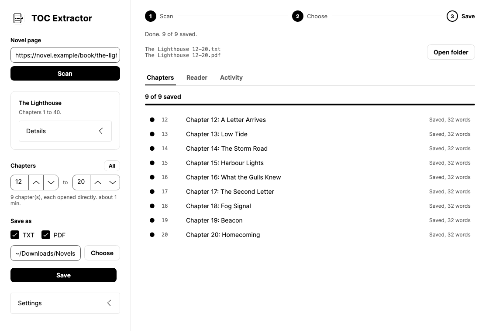
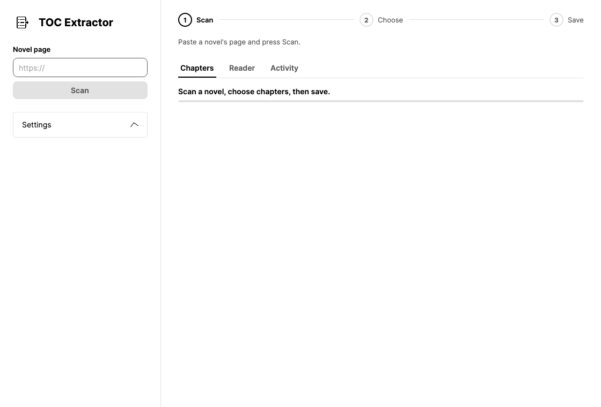
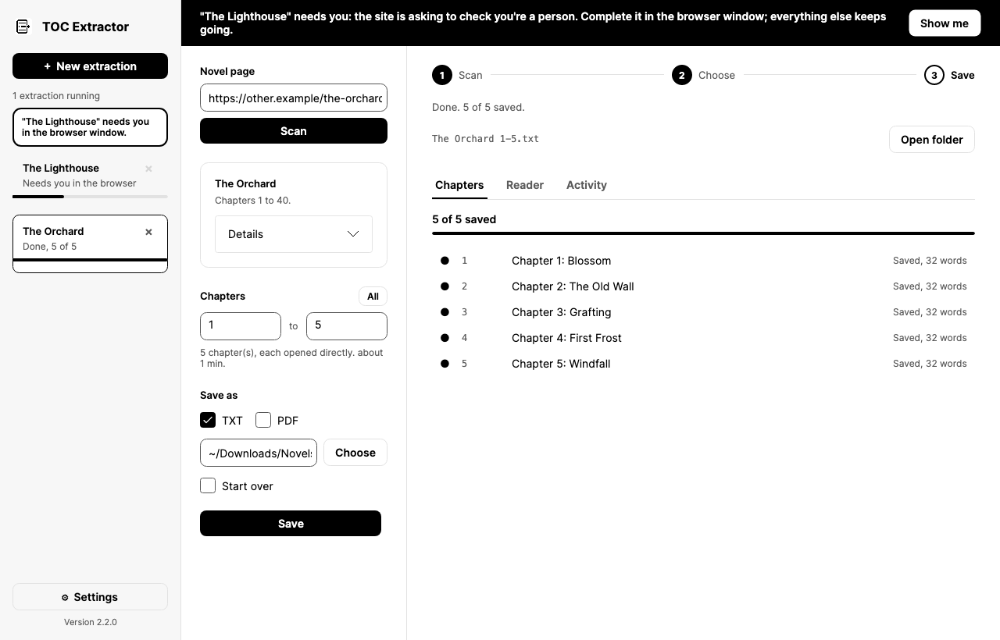
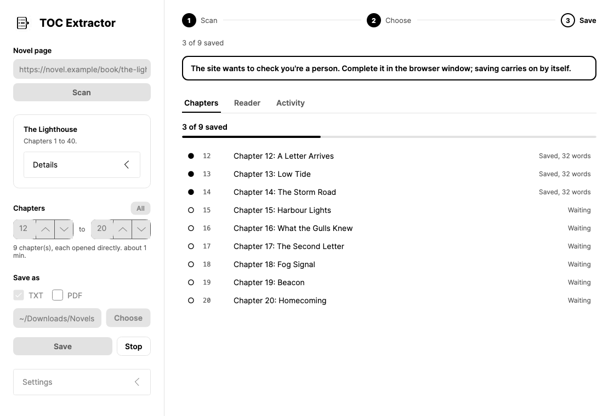
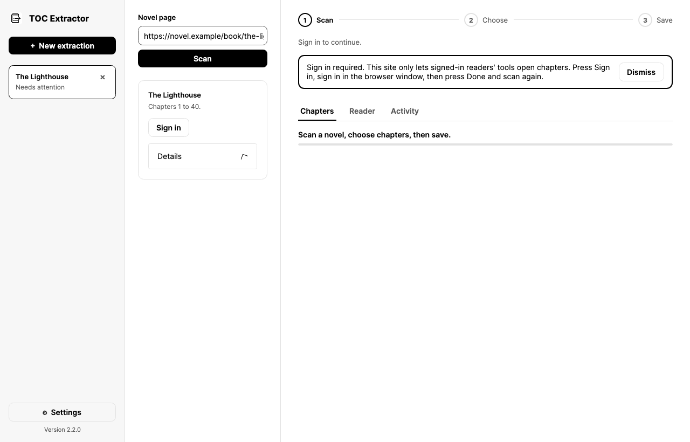

<p align="center">
  <picture>
    <source media="(prefers-color-scheme: dark)" srcset="docs/images/logo-dark.svg">
    
  </picture>
</p>

<p align="center">
  Save any chapters of a web novel as one clean TXT or PDF, on Mac or Windows.
</p>

<p align="center">
  <a href="https://github.com/VijaysinghPuwar/TOC_Extractor/releases/latest"><strong>Download the app</strong></a>
</p>

<p align="center">
  <a href="https://github.com/VijaysinghPuwar/TOC_Extractor/actions/workflows/ci.yml"></a>
  <a href="https://github.com/VijaysinghPuwar/TOC_Extractor/releases/latest"></a>
  <a href="LICENSE"></a>
</p>

---

## What is this?

Web novels are often hundreds or thousands of chapters long, one page per
chapter, with ads and menus around every one. TOC Extractor is a desktop app
that saves just the story, in reading order, so you can read it offline.

<p align="center">
  <picture>
    <source media="(prefers-color-scheme: dark)" srcset="docs/images/how-it-works-dark.svg">
    
  </picture>
</p>

1. **Paste** the novel's main page.
2. **Scan.** The app finds the chapter list and where the story text sits.
3. **Choose** the chapters you want, for example 350 to 400.
4. **Save** them as one TXT, one PDF, or both.

There is nothing to set up per site. The scan works out each site's layout
by itself.

And while one book saves, you can start the next: run as many at once as you
like, each with its own progress bar. There are options for audiobooks, a
detailed log of everything the app does, and when a site asks the app to
prove it is a person, the app takes that as a sign to slow down and reads
that site gently from then on.

<p align="center">
  
</p>

## Under the hood

For engineers and reviewers. Each line below is backed by a test in this
repository or by a measured live run.

| Area | What it does |
|---|---|
| **Stack** | C# on .NET 10 with Avalonia 12 for the desktop app on macOS and Windows, and Microsoft Playwright driving Chromium. The original Python tool is kept as a reference implementation; both are checked against the same test data for text cleaning, file names and robots.txt. |
| **Concurrency** | Any number of downloads run at once in one shared browser whose tab pool grows on demand. Downloads of the same book share one progress record behind a lock. Downloads from the same site share one rate limiter, so running ten books never asks more of a site than running one. |
| **No per-site setup** | Scripts run inside the page to find the chapter list, the story text and the next and previous links. Address patterns such as "id = 3,254,000 + chapter" are inferred and then checked on the live site before they are used. An address that carries the site's own id (`/chapter/4815162/the-gate`) is numbered by its title, or by its place when titles carry no number. A list the page pages through by itself, with buttons that have no address, is read whole from the page as the site sent it. Books that restart their numbering in each arc are numbered by position instead. |
| **Nothing skipped or doubled** | Removing ads and menus from a chapter is the one step that could drop a paragraph unnoticed, so every chapter is compared, line by line, with the whole story box as the page showed it. A left-out line long enough to be story, a paragraph saved more often than the page shows it, or two chapters with identical text is flagged on that chapter, named in the final status, and logged. A line the site repeats on every page (a standing notice) does not count. |
| **Adapts to the machine** | The browser's tab ceiling comes from the computer's memory and cores (8 tabs on an 8 GB Mac, 40 on 24 GB, 48 at most), and no new tab opens while macOS reports memory is short. Idle tabs close after 30 seconds; pictures, video and web fonts are not loaded while the app reads on its own. |
| **Fault tolerance** | A tab that is closed or crashes is replaced, and a closed browser is relaunched, without failing the download. A failure in one download cannot stop another. A book file is named only for the chapters it actually contains. |
| **Politeness** | Follows robots.txt (RFC 9309) and Crawl-delay. A "verify you are human" check is treated as the site saying the app is going too fast: that site is read at one page every 12 seconds from then on, shared by every book on it, and the person clicks the check themselves. The app never solves or works around a check. A check that says it cannot finish, for a person either, ends the wait at once instead of leaving the person waiting. |
| **Observability** | One CSV log, written as events happen: every page load with its timing, every retry and its cause, every check, and every error with its stack trace, including unhandled exceptions. |
| **Tests** | The tests pin what would hurt a reader if it broke: a redirect to a private network address is refused mid-chain; robots.txt is decided identically by the C# and Python code on a shared conformance corpus; resuming never refetches or drops a chapter, even with two ranges of one book saving at once; a book file is never named for chapters it lacks; and real Chromium, against a local test server, heals a closed tab and never navigates away from a check the person is clicking. Warnings are errors, and CI runs on Linux, Windows and macOS. Tagging a version builds and self-tests the Mac and Windows packages before publishing them. |
| **Scale tested** | Live runs of 40 books at once across five sites, 50 chapters each (2,000 chapters), repeated for each change, with every saved chapter audited for gaps, order, duplicates and doubled paragraphs, and 91 of them compared word for word with the live page. Against 2.2.1 on the same 40 books, with the app told it had an 8 GB Mac: average CPU 272% to 142%, average memory 5.6 GB to 4.8 GB, peak 8.2 GB to 7.1 GB, same time taken. |

## Download

Get the latest version from the
[Releases page](https://github.com/VijaysinghPuwar/TOC_Extractor/releases/latest).

| Your computer | File to download |
|---|---|
| Mac with Apple silicon (M1 or newer) | `TOC-Extractor-...-macos-arm64.zip` |
| Mac with Intel | `TOC-Extractor-...-macos-x64.zip` |
| Windows 10 or 11 | `TOC-Extractor-...-windows-x64.zip` |

**Mac:** unzip it and move **TOC Extractor** to Applications. The first time,
right-click the app and choose **Open**. macOS asks once, because the app is
not from the App Store.

**Windows:** unzip the folder anywhere and run `TocExtractor.exe`. If a blue
SmartScreen box appears, choose **More info**, then **Run anyway**.

The first time it starts, the app downloads its own private browser (about
150 MB to download, 350 MB on disk). It is kept in the app's own data folder
and never touches the browser you normally use.

## Using the app

<p align="center">
  
</p>

1. Paste the address of the novel's main page (the one with the chapter
   list) into **Novel page**, then press **Scan**.
2. The app shows the book's name and how many chapters it found.
3. Under **Chapters**, type the first and last chapter you want, or press
   **All**. Below it, the app says how long it will take.
4. Tick **TXT**, **PDF**, or both, and pick a folder. Each book gets its own
   folder inside it.
5. Press **Save**. Each chapter appears in the list as it is saved. Open the
   **Reader** tab to read one (with **Copy text**), or **Activity** to see
   every step.
6. Press **+ New extraction** at the top left to start another book straight
   away; this one keeps going.

Press **Stop** at any time. Nothing is lost: the chapters saved so far are
written as a TXT or PDF straight away, and next time the app skips the
chapters it already has.

### Several books at once

<p align="center">
  
</p>

You never have to wait for one book to finish before starting the next.
Press **New extraction** at the top left, paste another novel's page, choose
its chapters and press Save. Every extraction appears in the list on the
left with its own progress bar, and they all keep going in the background.
Click one to see its chapters, reader and activity. There is no limit on how
many you run.

You can even save two parts of the same book at once, say 101 to 150 and 151
to 200: both go into the same book folder and share its record of what is
saved, so neither undoes the other. Books from the same site share that
site's pace, so two extractions from one site never ask more of it than one
would, which keeps "are you a person" checks rare. Books from different
sites do not slow each other down. Close a finished extraction with the
**×** beside it.

If the app's browser tab is closed, or even the whole browser window, the
app opens a new one and carries on. Before, every chapter after that point
failed.

### Long books

The app does not click through a book one chapter at a time to reach
chapter 2000. It learns how the site numbers its chapter addresses, checks
that guess on the real site, and then opens each chapter you asked for
directly. If a site gives no such pattern, the app walks from the nearest
chapter it knows. When that would mean visiting a lot of extra pages, it
tells you first and waits for you to press Save again.

### When a site asks "are you a person?"

<p align="center">
  
</p>

Some sites show a check halfway through a long download. The app pauses
that site's work (everything else keeps going), keeps the check on its own
tab so it cannot be navigated away while you click, and tells you: a bar
across the top of the window with a **Show me** button that brings the
check to the front, and on a Mac a notification with a sound, or on Windows
a flashing taskbar button, repeated every five minutes while the site still
waits. It waits for as long as it
takes, so nothing fails while you are away; press Stop to give up instead.
Once you finish the check, saving carries on by itself. The app also takes
the check as a sign it was going too fast, and reads that site carefully from
then on, a page every 12 seconds. While it does, the
window says so ("Going slower on purpose"), and the time estimate before you
press Save allows for it, so a slower download is never mistaken for a stuck
one. Settings, Sites, lets you choose speed instead for any site.

The app never tries to solve these checks for you. Some checks, such as
Cloudflare's "Verify you are human", may refuse any browser that another
program is controlling, even after you click them. If that happens three
times, the app says so plainly instead of trying forever.

### Sites that need you to sign in

<p align="center">
  
</p>

Some sites only show whole chapters to members. The scan spots this and
shows a **Sign in** button. Press it, sign in on the site in the browser
window yourself, then press **Done** and scan again. The app never sees or
stores your password; the site remembers you the same way your own browser
would.

## What you get

```
Your folder/
  The Lighthouse/
    The Lighthouse 12-20.pdf                 the range as a book, if PDF is ticked
    The Lighthouse 12-20.txt                 the same as one text, if TXT is ticked
    Chapters/                                the app's working files, one per chapter
      012 - Chapter 12.txt
      013 - Chapter 13.txt
      ...
```

The book files are all you need. The Chapters folder is how the app knows
what it already has, so a later save never downloads a chapter twice; leave
it be, or delete the whole book folder to start fresh. Books saved by older
versions are tidied into this layout the next time you save them.

### Checked as it saves

Every chapter is checked against the page it came from as it is saved. If a
line of the page that looks like story did not make it into the chapter, or
a paragraph was saved twice, or two chapters came out with exactly the same
text, the app says so: the chapter is marked **!** in the Chapters list with
what is wrong, and the status at the end names every such chapter, for
example "Chapter(s) 12, 40: some text on the site's page was not saved; open
them in the Reader to check." The log keeps the first words of anything left
out. Short things a site puts in the story box, such as "Share to your
friends", reading-time counters or a one-line advert, are left out on
purpose and do not count.

A book file is only ever named for the chapters it really holds. If you ask
for 1 to 50 and chapter 27 fails, or you press Stop there, you get
`The Lighthouse 1-26.pdf`, never `1-50`. Chapters saved after the gap are
kept, and join the book when you press Save again and the gap is filled; the
full `1-50` file then replaces the shorter one.

Only the chapter heading and the story text as a reader sees it on the page
are kept. Ads, menus, comments and "next chapter" links are left out.

### Settings

Press **Settings** at the bottom left. It opens a full settings screen in the
same window; press **Back** to return. Changes are saved as you make them.

- **Appearance**: match the computer, or always light, or always dark.
- **Logs**: keep a detailed log (CSV) of every extraction, and **Open log
  folder** to see them.
- **Pace**: how many chapters each extraction fetches at the same time, and
  how many seconds to wait between pages. The default is one to two
  seconds. Tested on four sites, 100 chapters each, it saved every chapter
  complete with no errors.
- **Sites**: sites that have asked to check you're a person. The app learns
  these itself: the first time a site asks, it reads that site carefully from
  then on, a page every 12 seconds. Turn Careful off for a site to go at the
  normal pace (you click any check yourself), or press Forget to start it
  fresh.
- **Text**: keep links in the text, and remove ad markers.
- **For audiobooks (text to speech)**: leave chapter numbers and titles out
  of the TXT book and **Copy text**, so a voice goes straight into the story
  (the PDF keeps them); and remove symbols a voice would read aloud, such as
  lines of `=====` or `-----` and stray `# _ = * ~ |`. Words and punctuation
  are never changed. Press Save again to rebuild a book with these;
  nothing is downloaded again.

**Start over**, under Save as, fetches every chapter again, even ones already
saved.

### Logs

The app keeps one log, `TOC Extractor log.csv`, and every extraction writes
into it, one row per step, as it happens: the scan, each page opened and how
long it took, retries and why, checks that needed you, every chapter saved or
failed with the reason, the files written, and anything that went wrong,
with its full technical details. The **job** column says which extraction a
row belongs to, such as `#2 The Lighthouse`, so filter on it to follow one
book; rows marked `app` are the app starting, stopping, or crashing. If the
app ever closes unexpectedly, the log shows what it was doing at that
moment. It opens in Excel, Numbers or Google Sheets. Past 20 MB it is set
aside as `TOC Extractor log (previous).csv` and a new one begins.

The log folder is `~/Library/Application Support/TOC Extractor/logs` on a
Mac and `%APPDATA%\TOC Extractor\logs` on Windows.

## Good manners are built in

This app is meant for reading, and for content you have the right to save.
It behaves like a patient reader, not a bot hammering a website:

- **It follows each site's rules.** Websites publish a file called
  `robots.txt` that says what automated tools may visit. If a site says no,
  the app stops. The only exception is a site you have signed in to yourself.
- **It takes its time.** It waits between pages, and a site that asks for a
  check is read at a gentle pace from then on. Books from one site share its
  pace, so running several never asks more of a site than one would.
- **It does not break in.** No captcha solving, no disguises. If a site needs
  a person, you do that part yourself.
- **It stays on the public web.** Links to private or local network
  addresses are refused.

Please respect each site's Terms of Service.

## Common problems

**The scan says no chapter list was found.**
Paste the novel's main page, the one that lists the chapters, rather than a
chapter page.

**"The site's security check did not let this browser through."**
Wait a few minutes and scan again. Some sites block every automated browser,
and then the app cannot save from them.

**The first start is slow.**
The app is downloading its browser. This happens once.

**Mac says the app "cannot be opened".**
Right-click the app and choose **Open** instead of double-clicking it.

**One site is much slower than the others.**
That site asked to check you're a person before, so the app now reads it at a
careful pace (a page every 12 seconds, shared by every book from that site).
The window says so while it happens. To go at the normal pace and click any
check yourself, turn Careful off for that site in Settings, Sites.

**The app says a chapter "came out much shorter than the rest".**
Open it in the Reader. Usually the site's own page really is short (an
author's note, say); the app points it out so a page that loaded without its
story never slips unnoticed into your book.

**A book file is called 1-26 when I asked for 1-50.**
Chapter 27 did not save (the Chapters tab says why). The file holds only the
chapters it names. Press Save again to fetch what is missing; the full file
then replaces the shorter one.

**A chapter is marked ! and says words on the page were left out.**
Open it in the Reader and compare it with the site. Usually it is something
the site placed inside the story box that is not story; if a paragraph really
is missing, the log (Settings, Open log folder) shows the first words of what
was left out, so it can be reported.

**The browser window shows pages without pictures.**
That is on purpose. While the app reads on its own it skips pictures, video
and web fonts, which it never saves, so pages load faster and use less
memory. Pages load in full while you are signing in or completing a check.

**Some chapters say "Page 12" instead of "Chapter 12".**
That is how the site names them. Some sites split a book into pages that do
not line up with its chapters, and the app keeps the site's own label rather
than guess.

---

## The command line version

The original Python tool is still here, for people who like the terminal or
want to script it. You tell it three things about a site (where the chapter
links, the title, and the story text are) and it saves every chapter.

### What you need

- A Mac, Windows or Linux computer
- Python 3.11 to 3.14 (free, from [python.org](https://www.python.org/downloads/))
- About 5 minutes for the first setup

Playwright, the only runtime dependency, is installed for you in the steps
below. It lets the tool open web pages the same way a normal browser does.

### Getting started

Open the **Terminal** app and run these lines one at a time.

**1. Download the project**

```bash
git clone https://github.com/VijaysinghPuwar/TOC_Extractor.git
cd TOC_Extractor
```

**2. Set it up** (only needed once)

```bash
make setup
```

This creates a private workspace for the tool, installs what it needs,
downloads a browser for it to use, and checks that the app window will work.
If you do not have `make`, run these four lines instead:

```bash
python3 -m venv .venv
source .venv/bin/activate
pip install -e ".[dev]"
python -m playwright install chromium
```

**3. Open it**

```bash
make gui
```

This opens the Python version's own window, where you fill in the three
labels and press its three buttons in order. The command line reference is
under **For developers** below.

### What you get

```
downloads/
  001 - Chapter One.txt
  002 - Chapter Two.txt
  003 - Chapter Three.txt
  combined.txt          every chapter, joined in order
  manifest.jsonl        a record of what was saved (with the jsonl format)
```

You can choose the file type with `--format` (or the tick boxes in the app):

| Format | What it is good for |
|---|---|
| `text` | Plain text. Opens anywhere. This is the default. |
| `markdown` | Keeps chapter headings. Can be turned into an e-book with a free tool called pandoc: `pandoc book.md -o book.epub` |
| `jsonl` | A detailed record of every chapter, for people who want to process the results further |

Web addresses are removed from the chapter text by default so it reads
cleanly. The tool tells you how many it removed. Tick **Include source URLs**
(or use `--include-links`) to keep them.

### Stopping and starting again

You can stop a run halfway and start it again later. The tool remembers which
chapters it already saved and only fetches the ones that are missing. If the
site has added new chapters since last time, it picks those up too.

To throw away saved progress and start fresh, tick **Ignore saved progress**
(or use `--force`).

### Finding the three labels

This is the only fiddly part, and you only do it once per site.

1. Run a **dry run**. It looks at the contents page, lists the chapter links
   it found, and saves nothing:

   ```bash
   python -m toc_extractor --toc https://example.com/toc --link "a" --title "h1" --content "body" --dry-run --dump-html --screenshot
   ```

   The title and content labels are placeholders for now; a dry run does not
   use them. This also saves `toc.html` (the page) and `toc.png` (a picture of it) to
   the output folder. If the picture shows a sign-in wall, use the app instead
   so you can sign in first.

2. **Narrow the link label.** Start with `a` (every link) and make it more
   specific until the dry run lists only chapters.

3. **Check the content label.** Open one chapter in Chrome, right click the
   story text, choose **Inspect**, and look at the box that wraps the text.
   A good content label picks just the story, not the whole page.

4. Save your three labels in a small file, called a **profile**, so you never
   have to type them again (see below).

### Saving your settings in a profile

A profile is a short text file that remembers the labels and options for one
site. There is a ready example at `profiles/example.toml`.

```toml
[selectors]
link = "ol.toc a"          # every chapter link on the contents page
title = "h1.title"         # the chapter title on a chapter page
content = "article.reader" # the box holding the story text

[options]
min_delay = 1.5            # seconds to wait between pages, at least
max_delay = 3.0            # and at most
concurrency = 2            # chapters fetched at the same time
max = 25                   # chapters per run
formats = ["text", "jsonl"]
include_links = false
```

Use it like this:

```bash
python -m toc_extractor --profile my-site.toml --toc https://example.com/toc
```

Anything you type on the command line wins over the profile, so you can
change one setting for one run without editing the file. If the profile has a
typo in a setting name, the tool refuses it and lists the correct names,
rather than quietly ignoring it.

### Common problems

**"Tk is missing" or the app window will not open (Mac).**
The Python that comes from Homebrew does not include the part that draws
windows. Install Python from [python.org](https://www.python.org/downloads/),
then rebuild the workspace with it:

```bash
make clean
make setup PYTHON=/Library/Frameworks/Python.framework/Versions/3.14/bin/python3
```

The command line tool works without Tk either way.

**Every site fails with a certificate error (Mac).**
Python from python.org needs one extra step after installing. Open the
Python folder in Applications and double click `Install Certificates.command`.

**The first run is slow to start.**
The first time the downloaded browser opens, macOS checks it. This takes a
moment and only happens once. It has not frozen.

**The app cannot open the browser.**
A browser from an earlier run may still be open. Close it, then try again.

**Two chapters have the same name.**
The second one gets a number added (for example `Chapter One (2).txt`) so
nothing is overwritten. The log mentions it.

### Things it cannot do

- It cannot make e-books directly. Export `markdown` and use pandoc, as shown
  above.
- If a site's `robots.txt` cannot be reached at all, the rules say the tool
  may continue. It will, but it warns you clearly.
- It checks every page it visits, but images and scripts on a page are only
  blocked, not checked step by step.
- A rare network trick called DNS rebinding could get past the private
  address check. Closing that needs control the browser does not offer.

## Version history

**2.5.0** (2026-09-26)

From stress tests on Windows 11 (16 GB, 8 cores), 25 extractions at once. On
sites without a check, 25 books of 10 chapters took 4.5 minutes, every
chapter checked on disk, at the same speed and memory as 2.4.0 (average 4
processor cores, 2.7 GB). Nothing changes on the Mac but the first fix:
- Fixed: when two sites asked for a check at the same moment, a scan waiting
  on one could fail with "Collection was modified" as other books opened and
  closed tabs. It happened in every 25-book run on Windows where sites asked
  for checks.
- Windows: the app now reads how much memory is free, as it already did on
  the Mac, and stops opening tabs and closes idle ones while it is short.
  Before, with other programs open, 25 books took a 16 GB machine down to 6%
  free.
- Windows: Chromium and its profile (about 430 MB) moved from the roaming
  `%APPDATA%` to `%LOCALAPPDATA%\TOC Extractor`, which work networks do not
  copy at sign-out. The first launch moves them, keeping sign-ins.
- Windows: the taskbar button flashes when a site needs you.
- A novel page that loads too slowly is tried once more before the scan gives
  up, as a chapter already was; one slow page had cost a whole book.
- Windows: saving progress retries briefly when antivirus or search indexing
  holds the file; book folders never end in a dot or take a reserved name
  such as CON; long paths are enabled; "the browser from an earlier run is
  still open" is recognised in the words Windows Chromium uses; and the
  Windows build is precompiled, so it starts faster.

**2.4.0** (2026-09-26)

From live tests on new sites, then 40 books at once, 50 chapters each
(1,970 chapters, every one checked on disk: none missing, none doubled, no
retries, no errors, no checks, in 15.5 minutes, averaging 1.35 processor
cores and 4.4 GB):
- Fixed: on sites whose chapter addresses carry the site's own id
  (`/chapter/4815162/the-gate`), the id was taken for the chapter number,
  so a 104-chapter book was scanned as "1 to 173,027" with 2 chapters
  found. Chapters are now numbered by their titles, or by their place when
  titles carry no number, and each is opened directly.
- Fixed: a chapter list that the page pages through itself, with numbered
  buttons that have no address, showed only its first page of chapters. The
  whole list is now read from the page as the site sent it.
- Fixed: a "Next" link could be mistaken for another button with the same
  look (a search button), so reading on from a chapter went to the wrong page.
- Fixed: a security check that says it cannot finish, for a person either,
  left the app waiting for good. It now stops within seconds and says the
  site's check will not let the browser through, and it no longer ends or
  takes over another site's check that you are still completing.
- Fixed: once a site's check has failed, the scan stops opening more of that
  site's pages, instead of showing you a new check for each.
- A site whose robots.txt closes the novel page now says so, instead of
  "the novel page could not be read".

**2.3.0** (2026-09-25)

Measured on 40 books at once, 50 chapters each, against 2.2.1:
- Uses about half the processor time (average 272% to 142%) and less
  memory (average 5.6 GB to 4.8 GB, peak 8.2 GB to 7.1 GB), in the same time.
- Adapts to the computer: an 8 GB Mac opens at most 8 browser tabs, a 24 GB
  one 40, and none opens new tabs while macOS says memory is short. Idle
  tabs close, and a tab is emptied once its chapter is read, so the page's
  adverts stop running while it waits.
- Pictures, video and web fonts are skipped while the app reads on its own.
- New: every chapter is checked against its page as it is saved. Text left
  out, text saved twice, or two chapters with the same text is marked on the
  chapter and named in the status; when all is well, the status says so.
- Fixed: an advert frame that redirected while a chapter loaded was recorded
  as the chapter's address, and could fail the whole chapter.
- Fixed: a page a site served without its story was never retried; it is
  now tried once more.
- Fixed: a range past the end of the book showed "Ready to save"; it now
  says which chapters the book has.
- Fixed: very long books could fail to become a PDF after 30 seconds.

How it grew: 1.0.0 (September 2025) was a single Python script. 2.0.0
(August 2026) rebuilt it as a tested command line tool. The C# desktop app
came in September 2026, and 2.0.1 to 2.2.1 went out on the same day, each a
small release fixing what a live test on real sites had just turned up.

**2.2.1** (2026-09-25)

From a 20-book stress test on five sites:
- Fixed: two different novels with the same title (the same book on two
  sites, say) were given one folder, and the second was refused. The second
  now gets a folder of its own, named with its site.
- Fixed: when a site's first-chapter link leads to a cast list or a roster
  before chapter 1, that page could stand in for chapter 1 in the book. The
  page whose title names the chapter is now always the one used.
- Fixed: the time estimate ignored a site's careful pace, so it said "about
  1 min" for what takes ten. It now says how long, and why.
- The scan stops paging through a list as soon as a page adds nothing, so
  sites that count visits see fewer pages.
- The guide's screenshots now show this version of the app, and it lists the
  lines of code in each language.

**2.2.0** (2026-09-25)
- New: run as many extractions at once as you like. Each has its own entry
  on the left with a progress bar, and they all carry on in the background.
- New: a Settings screen with light, dark or automatic appearance, the pace,
  and **Open log folder**.
- New: one detailed CSV log for the whole app, written as it happens, with
  every page, retry, check and error of every extraction, and crashes.
- New: a book file is named for exactly the chapters in it. Asked for 1-50
  with chapter 27 failed, it is "1-26", never "1-50".
- New: two parts of the same book can be saved at the same time.
- New: audiobook options: leave out chapter headings, and remove symbols a
  text-to-speech voice would read aloud.
- Changed: the one-file-per-chapter working files now live in a Chapters
  folder inside the book's folder, so the book files are easy to find.
- Fixed: after a browser tab was closed or crashed, every later chapter
  failed with "Target page, context or browser has been closed". The app now
  opens a fresh tab, or a fresh browser, and carries on.
- Fixed: stopping part way now still writes the TXT and PDF of the chapters
  saved so far.
- Fixed: the chapter boxes were too narrow for four-digit numbers, so 1000
  looked like 100.
- Fixed: after Stop, the status could stay on "Stopping..." for good.
- Fixed: books that restart their chapter numbers in each part ("Arc 9:
  Chapter 38", "Book 2: Chapter 1") were numbered by those titles, so a
  range could mix chapters from different parts. They are now numbered by
  their place in the whole book.
- Fixed: a book whose chapter 1 address repeats its number
  (".../chapter-1-number-1") lost its first chapters from the scan.
- Fixed: on sites that write paragraphs as `<div>`s the story was not found,
  and a chapter whose title was laid out differently from the rest failed;
  it is now saved under the page's own title.
- Fixed: while a site's check waited for a person, other extractions could
  take over its tab, so the check kept coming back.
- New: when a site needs you, a bar across the window, a Mac notification
  and reminders make sure you notice, and the app waits for you instead of
  giving up after 15 minutes.
- New: a chapter far shorter than the rest of its book is named when saving
  finishes, so a page that loaded without its story never slips through.
- New: faster by default (one to two seconds between pages), and each site
  that asks for checks is learned and then read at a pace that keeps them
  away. Settings, Sites, lists them.

**2.1.0** (2026-09-25)
- New: a desktop app for Mac and Windows, written in C# with .NET. Paste a
  novel's page, scan it, choose any chapters, and save them as TXT or PDF.
- New: the scan finds the chapter list, the story text, and the site's
  chapter address pattern by itself. There are no labels to fill in.
- New: long books are fetched by address, so any range is quick to reach.
- New: pauses for "are you a person" checks and sign-in walls, and waits for
  you, instead of saving half a chapter.
- New: an optional CSV log of every step.
- Changed: the robots.txt rules are now read the same way on every Python
  version, following the published standard (RFC 9309).

**2.0.1** (2026-09-25)
- Fixed: when a chapter page loaded but your content label matched nothing,
  the tool wrongly called it a timeout and tried twice more. It now says the
  label matched nothing and moves on straight away, which is faster and far
  easier to fix.
- Fixed: a dry run with `--dump-html` now really saves `toc.html`. Before, it
  quietly skipped it.
- Fixed the automatic checks on GitHub, which had been failing since 2.0.0.
  The checks were set up wrongly; the tool itself was not affected.
- Rewrote this guide for people who are new to the project, with pictures.
- Updated the GitHub automation to current versions.

**2.0.0** (2026-08-08)
- Rebuilt from three separate scripts into one tested program.
- New: profiles, resume after stopping, Markdown and JSONL output, fetching
  several chapters at once, and a rebuilt app window.
- New: follows `robots.txt` and each site's requested wait time.
- Changed: file names with runs of odd characters are tidier. `Chapter//One`
  used to become `Chapter__One` and is now `Chapter_One`. Chapter text is
  exactly the same as before.

**1.0.0**
- First release: a command line script and a simple app window.

---

<details>
<summary><strong>For developers</strong></summary>

### The desktop app (C# and .NET)

```
dotnet/
  src/TocExtractor.Core      rules: links, robots.txt, pacing, fetching, files
  src/TocExtractor.Browser   Playwright page source, PDF printing
  src/TocExtractor.App       scanner, range planner, sessions, CSV log
  src/TocExtractor.Cli       the same pipeline as a command line
  src/TocExtractor.Desktop   Avalonia window, MVVM view models
  tests/                     xUnit, including headless window tests
```

```bash
cd dotnet
dotnet test --project tests/TocExtractor.Core.Tests
dotnet test --project tests/TocExtractor.Desktop.Tests   # renders the window with no screen
dotnet run --project src/TocExtractor.Desktop
../packaging/macos/make-app.sh osx-arm64                 # builds and self-tests the .app
```

Built on .NET 10, Avalonia 12 and Microsoft.Playwright, with warnings as
errors and the recommended analysers on. CI runs every .NET test project on
Linux, Windows and macOS. Pushing a `v` tag builds the Mac (Apple silicon and
Intel) and Windows downloads, runs each one's self-test, and publishes them
to a GitHub release. The screenshots in this guide come from the headless
window tests, run against a made-up book.

How the scan works: scripts run inside the page to find the largest group of
links that look like chapters, then the block of text that stays the same
shape across two sample chapters. Addresses are compared to find a pattern
such as "id = 3,254,000 + chapter number", which is checked against the live
site before it is used. The Python tool and the C# app share test corpora
for text cleaning, file names and robots.txt, so both read the rules the
same way.

### The Python tool

### Commands

```bash
make setup       # venv, install, Chromium, Tk check
make deps        # venv and install only, no browser
make lint        # ruff check and format check
make typecheck   # mypy, strict, over src/
make test        # full suite, browser tests included
make test-fast   # skips browser tests; what the CI matrix runs
make run ARGS='--toc ... --link ...'
make gui
```

CI runs lint, strict mypy, the test suite on Python 3.11 to 3.14 on Linux and
3.14 on macOS, and the browser tests on one job with Chromium cached.

After changing a flag, regenerate the reference below:

```bash
./.venv/bin/python scripts_gen_readme.py
```

To read the v1 to v2 rewrite: `git diff v1.0.0..v2.0.0`.

### Command line reference

<!-- cli-reference: generated, do not edit by hand -->

```
usage: toc-extractor [-h] [--version] [--gui] [--profile PROFILE] --toc TOC
                     [--link LINK] [--title TITLE] [--content CONTENT]
                     [--max MAX] [--out OUT] [--include-links]
                     [--format FORMAT] [--no-strip-ads] [--dry-run] [--force]
                     [--dump-html] [--screenshot] [-v] [-q] [--ua UA]
                     [--storage-state STORAGE_STATE] [--headful]
                     [--timeout TIMEOUT] [--min-delay MIN_DELAY]
                     [--max-delay MAX_DELAY] [--retries RETRIES]
                     [--wait-after-load WAIT_AFTER_LOAD]
                     [--concurrency CONCURRENCY] [--allow-private-hosts]

Extract chapter text from a table-of-contents page using CSS selectors you supply. Use only on content you own or are permitted to access.

options:
  -h, --help            show this help message and exit
  --version             show program's version number and exit
  --gui                 Open the graphical front end instead of running from
                        the command line

source and selectors:
  --profile PROFILE     TOML file holding the three selectors and optional
                        defaults. Flags you pass explicitly override it. See
                        profiles/example.toml.
  --toc TOC             TOC URL (must start with http/https)
  --link LINK           CSS selector for chapter links on the TOC page
  --title TITLE         CSS selector for title on a chapter page
  --content CONTENT     CSS selector for content on a chapter page

output:
  --max MAX             Max chapters to fetch (default: 20)
  --out OUT             Output folder (default: downloads)
  --include-links       Include source URL in saved files
  --format FORMAT       Output format, repeatable (default: text). Choices:
                        jsonl, markdown, text. For EPUB, export markdown and
                        run: pandoc book.md -o book.epub
  --no-strip-ads        Do NOT strip common ad markers from text

behaviour:
  --dry-run             List discovered chapter URLs and exit
  --force               Discard any saved progress and start over (resume is
                        the default)

debugging:
  --dump-html           Save TOC HTML to out/toc.html
  --screenshot          Save TOC screenshot to out/toc.png
  -v, --verbose         Show debug output
  -q, --quiet           Show warnings and errors only

browser:
  --ua UA               Custom User-Agent string
  --storage-state STORAGE_STATE
                        Path to Playwright storage state JSON (reuses login)
  --headful             Run headed (GUI). Default is headless.
  --timeout TIMEOUT     Navigation timeout ms (default: 25000)

politeness:
  --min-delay MIN_DELAY
                        Min delay between chapters (s)
  --max-delay MAX_DELAY
                        Max delay between chapters (s)
  --retries RETRIES     Retries per chapter on errors (default: 2)
  --wait-after-load WAIT_AFTER_LOAD
                        Extra settle wait per page (ms)
  --concurrency CONCURRENCY
                        Chapters fetched at once (default: 3). The per-host
                        delay still applies.
  --allow-private-hosts
                        Permit hosts resolving to loopback or private ranges
                        (for local testing)
```

<!-- /cli-reference -->

### How it is built

```
TOC page -> parser -> politeness -> fetcher -> exporters -> files
            vets      robots and    bounded    text
            links     rate limit    workers    markdown
                                               jsonl
```

`PageSource` is the seam between the fetch loop and Playwright. Most tests run
against a dict-backed stub with no browser at all; only browser-marked tests
open Chromium.

A few decisions look odd without context. Each came from a measured failure:

- **The rate limiter is acquired inside the concurrency semaphore.** Acquiring
  it first lets every pending worker queue on the limiter, and the concurrency
  ceiling stops meaning anything. A test runs five workers against one host and
  asserts the spacing holds.
- **Redirects are followed by hand.** Playwright's `route` handler fires once
  per navigation, not per redirect hop. The handler fetches with
  `max_redirects=0`, validates each target, and aborts on the first disallowed
  hop. Because the body is fulfilled at the original URL, the final URL is
  tracked in the handler rather than read from `page.url`.
- **One browser page per worker.** Two concurrent `goto()` calls on one page
  abort each other with `net::ERR_ABORTED`. That passed 447 tests and failed
  on the first live run, so the stub now models page exclusivity.
- **"Could not check robots.txt" is not "no rules".** RFC 9309 treats a 404 as
  no restrictions. Treating every failure that way meant a local TLS problem
  silently marked every site unrestricted. Non-404 failures now warn loudly.
- **The robots override needs evidence of a session.** After the GUI's manual
  sign-in step, a signed-in session may pass a `Disallow`. It is keyed on the
  session carrying cookies, not on the Ready button, so an anonymous run still
  gets a hard refusal. Every overridden rule is shown and recorded in the
  manifest.

### One invariant, four checks

Every link is accounted for: `raw == kept + rejected + truncated`. It is
checked in the `LinkCollection` constructor, at the `PageSource` error
boundary, in `run()` before it returns, and where output is merged. Each check
was added after a real bug where content disappeared silently:

| What vanished | How |
|---|---|
| SVG-anchor chapters | `SVGAnimatedString` arrives in Python as `{}`, truthy in JavaScript and falsy in Python, so an `if link` filter dropped it |
| A whole run | a stdlib `TimeoutError` escaped the retry vocabulary and killed the task group |
| One chapter, silently | `asyncio.TaskGroup` absorbs a child's `CancelledError` and discards the task with it |
| Everything a resume did not refetch | the merged file was rebuilt from only the chapters that run fetched |

### Resume rules

Resume is the default, keyed on URL; there is no `--resume` flag. Growth at
either end of the TOC resumes and fetches only new chapters. Removals or
reordering refuse with specifics, because chapter numbers would stop matching
files already written. Chapters added at the start are numbered in fetch order,
and the tool says so.

### Filenames

APFS is case-insensitive, so colliding titles get a numeric suffix and a log
line. Names are normalised to NFC, capped at 255 bytes, and leading dots are
stripped so `.Prologue` does not vanish from Finder.

</details>

## License

MIT. See [LICENSE](LICENSE).
